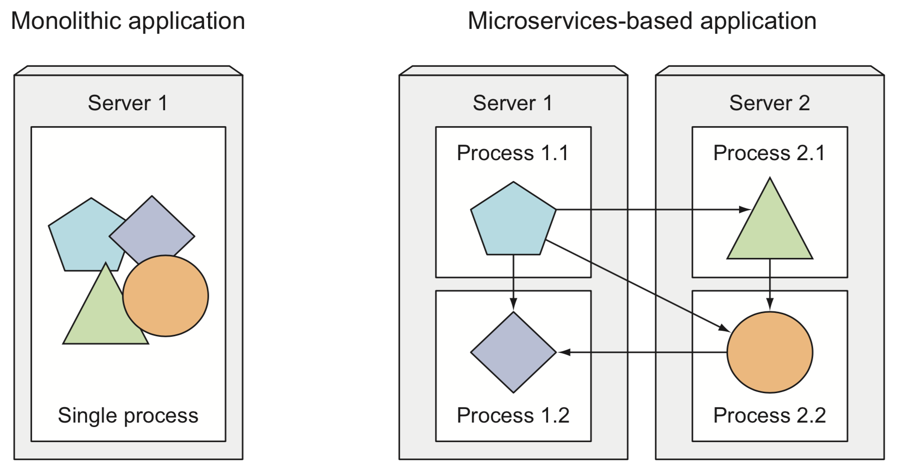

# Part 1: Introduction to Microservices

In the past, applications used to be monolithic, running as a single process or many small ones spead cross a few servers.
These have disadvantages:

- Slow release cycles: devs packaged the whole system and delivered it to the ops team, to deploy and monitor it.
- Infrequent updates
- Manual migration to healthy servers if the application failed

Today, we break down these big applications into smaller components known as __microservices__.
Because these are decoupled, they are individually developed, deployed and updated.

__Kubernetes__ allows us to automate these tasks, helping with configuration, monitoring and handling of failures.
It enables devs to do their own deployment, while helping ops to automatically monitor and reschedule the apps in case of failures. Also, sysadmins now don't need to supervise the apps, but Kubernetes and the infrastructure instead.
 

## From Monolithic apps to Microservices

A monolithic app is made of components that are tightly coupled together, in order to provide more resources to it, we need to _scale vertically_ (providing more CPU, memory, etc) or _horizontally_ (creating more __replicas__ of the app in different servers - known as __scalling out__).

As the app is a big entity, scalling one of its components means that we need to scale all of them. If one of them cannot be scalled, then the whole application becomes unscalable.

When we move into a __microservices__ architecture, the application becomes a sum of different independent components which comunicate with each other via simple APIs.

Microservices communicate through:
- Synchronous protocols like HTTP, exposing an API (i.e. a RESTful API - REpresentational State Transfer)
- Asynchronous protocols like AMQP (Advance Queuing Message Protocol)

Because the processes are now independent, it's possible to develop and deploy these components separately, and making changes to one of them (unless they are breaking changes) should not affect all the rest of the components.

## Scaling Microservices

With microservices, it's possible to scale only those components that require it, allowing us to scale horizontally the components that can be replicated, and scalling vertically those that cannot (i.e. a relational database).

## Deploying Microservices

When it comes to deploying, it can be more difficult to deploy multiple components if we compare it to deploying a single monolithic application. As the components need to talk to each other, we need to configure them all to make sure they can work as a single system.

It can also be harder to debug and trace execution calls, as they will happen across different services and machines.
 

## Managing dependencies

As the components in a microservices architecture are independent, it's quite possible that the teams working on these are different and the libraries used across different components vary in the versions they require. This makes it hard to manage dependencies and conflicts are likely to happen.

