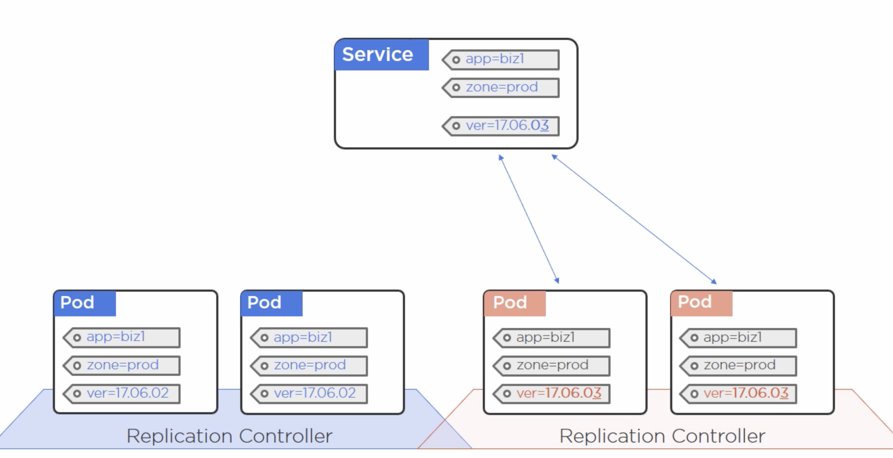

# Part 10: How to access our apps - Services

## Services

A Service in K8s is a REST object such as a Pod or RC. It is an abstraction that allows us to communicate with the pods, and load balances our requests to each of them. This way, if a pod dies and we get another with a different name, the Service will take care of making our requests reach this new pod as well.

With a service we will get a static __IP__, __DNS__ and __Port__ that we can connect to.

!(Service)[./images/services.png]
<br/>

The Service also allows us to connect to the pods from inside and outside the cluster:

  - __Inside the cluster:__ Pods can be accessed with the static IP and DNS that the service provides. The port defined in the server is the one that the app will be accepting requests on, in the pod.
  - __Outside the cluster:__ 

!(Service access)[./images/service-access.png]
<br/>

## Endpoints

When we create a service, we also create an __Endpoint__ object for the service. This object contains an updated list of the pods in the service (their IPs).

Endpoints are very useful for internal K8s objects as well, as they can simply get the IPs from the endpoint if they need to communicate with the pods.

!(Endpoints)[./images/endpoints.png]
<br/>

## Labels

The service knows which pods to target based on the labels specified in the selector. If a pod has these labels, they will be a part of the service.

!(Service labels)[./images/labels.png]
<br/>

## Service discovery

Service discovery can be implemented in different ways:

- __Based on DNS:__  works if we have the `DNS Cluster addon`, which implements a `DNS service` in the cluster. This service configures the `kubelet` (the k8s agent in a node) to use the service for a DNS. It also watches the `apiserver` for any new services declared, and it registers them in the DNS. The DNS names they get are names that can be resolved within the cluster.

- __With Environment Variables:__ the pod will get environment variables that will provide information about the service, however this means that the variables will not be set if the service is created after the pod is, so it's problematic.
<br/>

## Creating a service

We can create a service by asking for a service with `kubectl` (imperative) or by applying a manifest file that defines a service (declarative).

### Imperative way

The command to use to imperatively create a service is `expose`:

```
$ kubectl expose rc hello-replication --name=hello-service --target-port=8080 --type=NodePort
```

This will provide a virtual IP for the service, as well as a cluster-wide port that we can access the service on, available in NodePort. Now we can use the public IP of the nodes we have in our cluster (this will be the IP of the machine that contains our pods, we can have many of these IPs!), as well as the port mapped by NodePort, and access our app.
<br/>

### Declarative way

A service is a REST object, so we can define it in a yaml file, which again contains the usual 4 top-level resources. But it has a specific field definition for `spec`:

  -__type:__ defines the service type. In this case we have used `NodePort`, but there are other options as well:
    * _ClusterIP_ is the default option, provides a stable internal cluster IP, but only within the cluster.
    * _NodePort_ exposes the app outside the cluster as well, providing a cluster-wide port on top of `ClusterIP`.
    * _LoadBalancer_ integrates `NodePort` with a cloud-based load balancer.

  As these types are build on tope of each other, technically a `LoadBalancer` type is a `ClusterIP` type which also exposes the app externally via `NodePort`, and on top of that includes a load balancer.

  -__ports__:__ the `port` defined in ports specifies where the app is exposed in the container where it's running. This port is mapped to the port in the node (in the example below, the one used by NodePort, which is in the range of 30000). We can also define our own port to use with NodePort as seen in the example below (otherwise it will use a default port). And we can specify the protocol to use as well, which is `TCP` (the default) in the example below, but could be `UDP` as well.

  -__selector__:__ the selector defines how we pick up the pods which will be part of our service. This has to match with the pods we are defining in the application controller. We can use the `labels` for this.

```yaml
apiVersion: v1
kind: Service
metadata:
  name: hello-service
  labels:
    app: hello-world-app
spec:
  type: NodePort
  ports:
  - port: 8080
    nodePort: 30001
    protocol: TCP
  selector:
    app: hello-world-app
```
<br/>

## Updating our apps

As we define which pods in our cluster are part of our `Service`, this allows us to easily define which version of our app we want to show by using `labels`.

Our Service will always target the pods that match the labels in the selector, even if the pod has more labels than the ones specified in the Service.


<br/>

This allows us to be quite flexible in regards to doing app updates:

- If we want to have two versions running side by side:

<br/>

- If we want to upgrade to only use the new version, we can add a new label to match the specific version:

<br/>

- If we want to downgrade to rollback to a previous version, we can change the version label to match the old one:

<br/>
