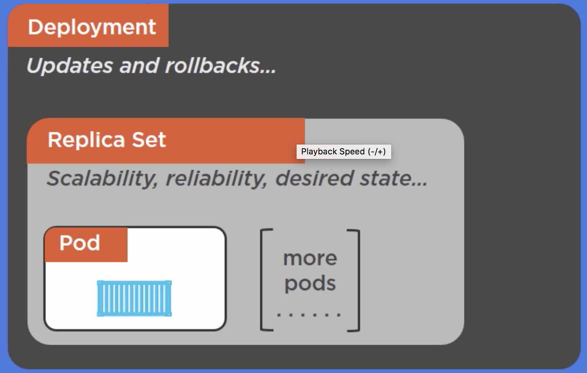

# Part 11: Kubernetes Deployments

## Deployments

Deployments are really helpful for `Rolling updates` and `Rollbacks`. They are also objects in the K8s platform.
`Deployments` are wrapped around `Replica Sets` which are mainly the same as a `Replication Controller`.


<br/>

Before we had Deployments, rolling updates were done this way:

1. We had our Replication Controller with the current version of the app.
2. We would create a new Replication Controller with the new version and give it a new name.
3. We would use the `kubectl rolling-update -f updated-rc.yml` command, which provides the new Replication Controller to use. Then K8s will take care of "moving" the pods across to the new RC with the new version.
<br/>

With Deployments, rolling updates are done in a new way:

1. We create a Deployment manifest file with our current version, which is given to the `apiserver`, which creates the Deployment in the cluster. This will actually create a `Replica Set` which contains the pods as well.
2. We change the same Deployment manifest file to use our new version and give this changed file to the `apiserver` again. Then it create a new `Replica Set` which contains the new version, and bring down the pods in the old `Replica Set` with our old version at the same time. We can even specify how many pods are brought up and down at the time so we have a smooth rolling update.
3. The old `Replica Set`, however, is not deleted. This means that we can then do a `rollback` and go back to the previous version easily.
<br/>

## Other details

Deployments also can have different settings to determine how we do the updates:

* _minReadySeconds_ allows you to specify how many seconds it should wait after each pod comes up to mark it as ready.
* _strategy_ allows you to define the strategy of the deployment, for example a `RollingUpdate` type, which lets you define how many pods can be unavailable at the time (`maxUnavailable`) and how many extra pods can we have during the update (`maxSurge`).

```yaml
apiVersion: extensions/v1beta1
kind: Deployment
metadata:
  name: hello-deployment
spec:
  replicas: 10
  minReadySeconds: 10
  strategy:
    type: RollingUpdate
    rollingUpdate:
      maxUnavailable: 1
      maxSurge: 1
  selector:
    matchLabels:
      app: hello-world-app
  template:
    metadata:
      labels:
        app: hello-world-app
    spec:
      containers:
      - name: hello-pod
        image: my-docker-image:v1
        ports:
        - containerPort: 8080
```
<br/>

While the deployment is running, we can run the `kubectl rollout status deployment hello-deployment` command to see the status of the deployment pod by pod. 

We can create the deployment with the `kubectl create` command, and update it with the new version of the file with the `kubectl apply` command.

We can also add the `--record` flag when creating or applying a deployment file, and this will record the command used for it in the history of revisions of the deployment, which we can get by using the `kubectl rollout history` command:

```
$ kubectl create -f my-deployment.yml

$ kubectl apply -f my-deployment.yml --record

$ kubectl rollout history deployment hello-deployment
deployments "hello-deployment"
REVISION    CHANGE-CAUSE
1           <none>
2           kubectl apply --filename=deploy.yml --record=true
```
<br/>

## Rollback a deployment

We can also easily undo a deployment change with the `kubectl rollout undo` command, providing the revision that we want to go back to.

```
$ kubectl rollout undo deployment hello-deployment --to-revision=1
deployment "hello-deployment" rolled back
```
