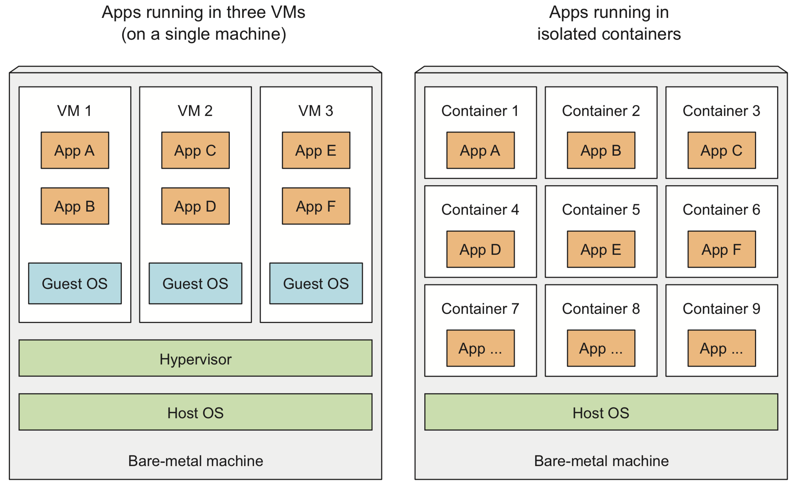
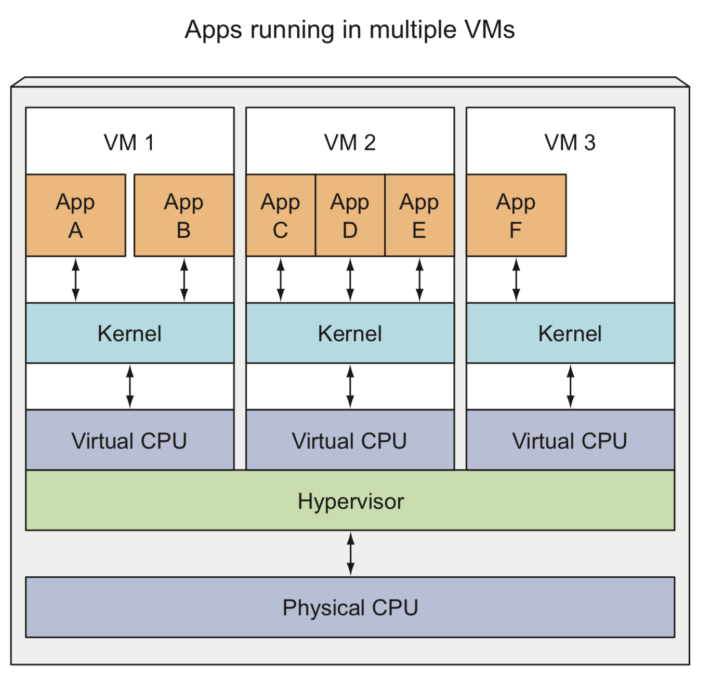
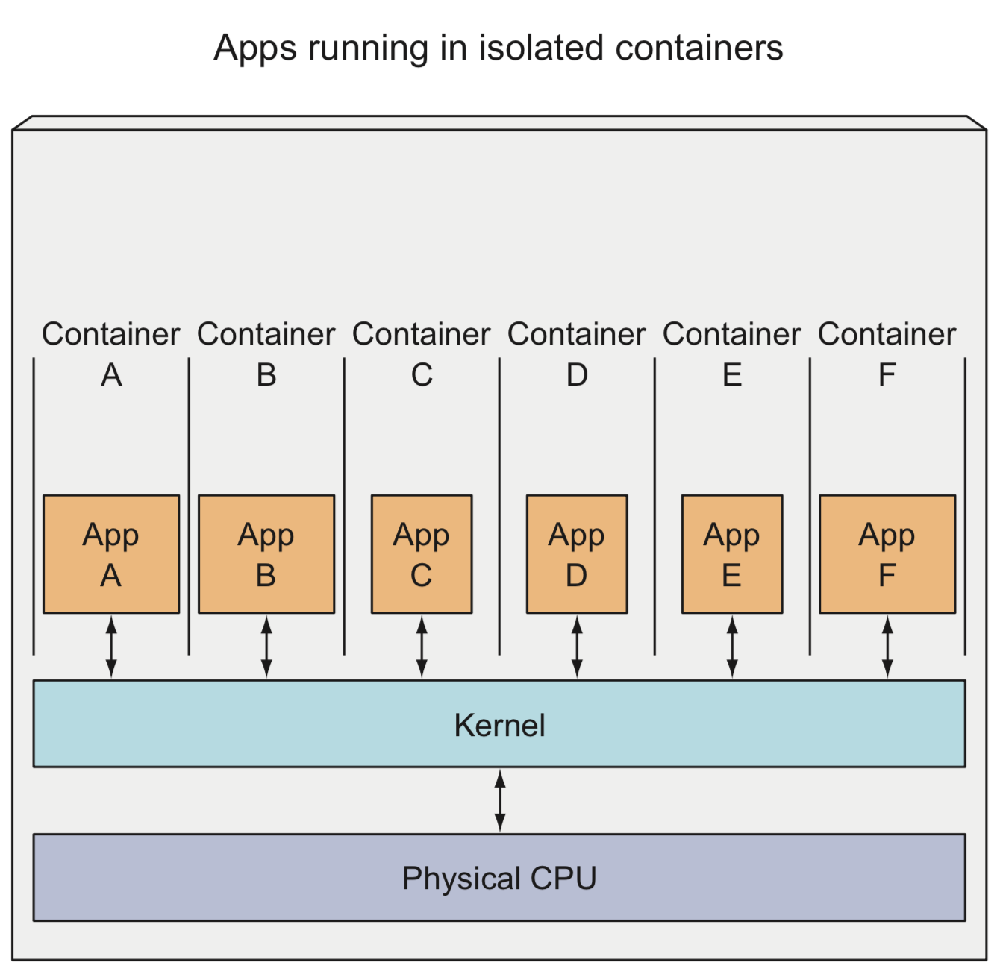

# Part 2: Introduction to Containers

The differences in the __environments__ used to run an application has always been a problem:
- Development environments
- Production environments
- Individual machine environments
- Hardware
- OS
- Libraries

To prevent problems, the ideal scenario would be to run an application always in the same environment, during development and production, with the exact same OS, libraries, system configuration, network environments, etc. Also, it would be ideal to add new applications to the server without affecting the existing ones.
 
 

## Container technologies

Kubernetes uses Linux container technologies (like __Docker__ and __rkt__) to isolate the different applications running.

When working with large applications, in small numbers, it's acceptable to use __Virtual Machines__ (VMs) for each component and isolate the environments. However, with small components running in large numbers, this consumes too many resources and increases the workload of sysadmins.

__Linux containers__ enable us to run multiple isolated services in the same host machine, with different environments for each of them.
 
 

## Containers vs VMs

Containers are more lightweight:
- __VMs:__ Require their own set of system resources.
- __Containers:__ Each container is a single isolated process, running in the host OS, consuming only the resources the app requires.

Containers are quicker:
- __VMs:__ As they require their own set of resources, they need to be booted up.
- __Containers:__ They use the resources of the host OS, so they don't need to boot up, the processes start immediately.

When we run three VMs in a host machine, we have three separate operating systems sharing the hardware. These run on top of the __host OS__ and the hypervisor (the __hypervisor__ divides the physical hardware resources into smaller virtual resources for the use of the VMs operating systems).
 

 

So, an application running in a VM will perform __system calls__ to the __kernel__ of the VM's OS. Then, this kernel will perform __x86 instructions__ via the __hypervisor__, on the host's physical __CPU__.

 

On the other hand, containers perform __system calls__ to the __kernel__ in the host OS. This kernel performs __x86 instructions__ in the host's CPU. Therefore, there's no need for virtual CPU nor hypervisor.

 

## Isolating containers

Containers can be isolated thanks to two Linux mechanisms:
- __Linux namespaces:__ ensures a process can only see its own view of the system.
- __Linux control groups (_cgroups_):__ limit the amount of resources that a process can use (CPU, memory, network bandwidth, etc).

### Linux Namespaces

Linux systems have initially one single __namespace__. The namespace owns system resources, such as:
- Filesystems
- Process IDs
- User IDs
- Network interfaces
...

We can add additional namespaces and organise the resources across them. Then, when a process runs inside a namespace, it will only see the resources that belong to it. A process can belong to one namespace of each kind.

The kinds of namespaces are:
- Mount (_mnt_)
- Process ID (_pid_)
- Network (_net_): determines the network interfaces the process sees
- Inter-process communication (_ipc_)
- UTS: determines the hostname and domain name the process sees, making it possible for processes to seem like they are running on different machines.
- User ID (_user_)
 

### Linux control groups

The Linux control groups, or _cgroups_ limit the resources that a process or group of processes can use. Therefore, a process cannot use more than the defined amount of CPU, memory, network bandwidth, etc.
