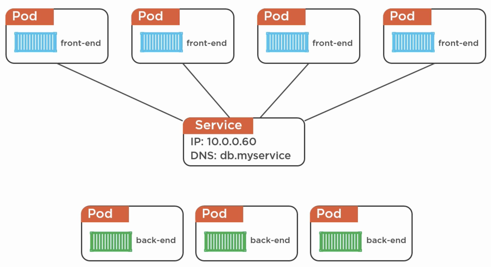
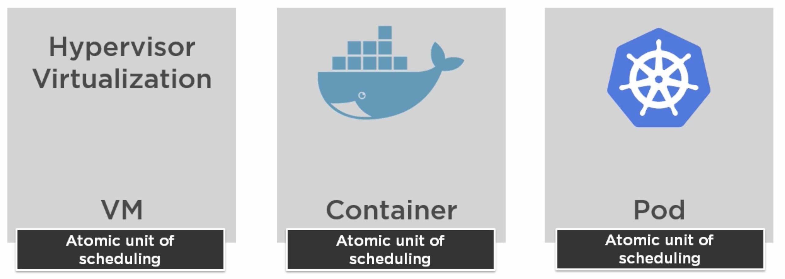
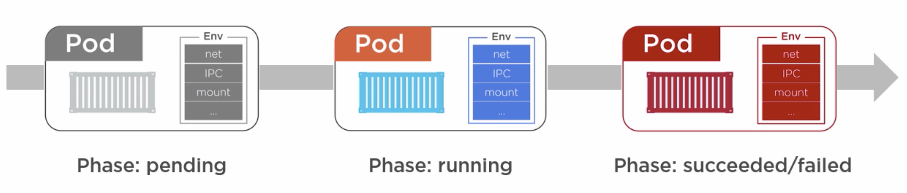
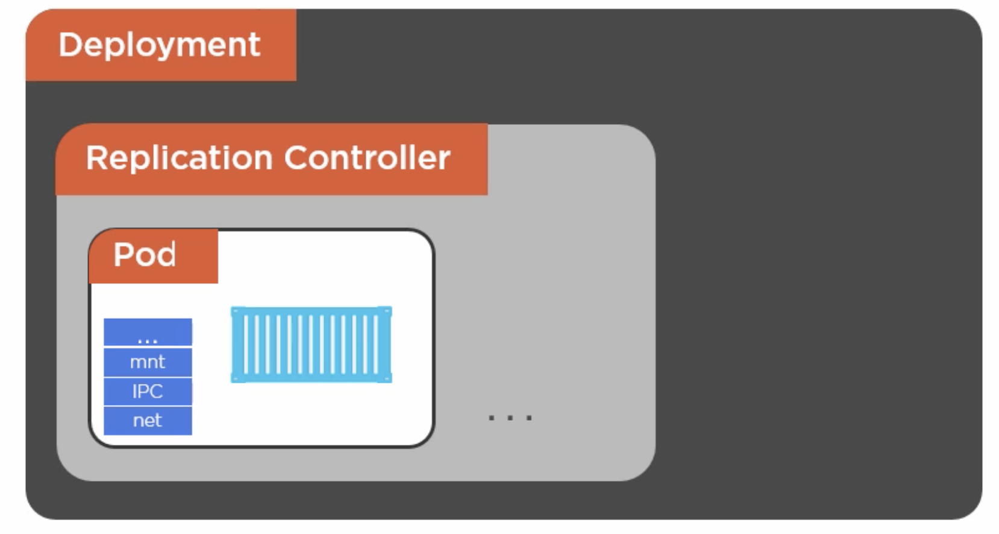

# Part 3: Introduction to Kubernetes

## What is Kubernetes?

Kubernetes is an __orchestrator__ for __microservice__ apps that run on __containers__.

A microservice app in Kubernetes would be made of multiple services (components), each of them packaged as a k8s __pod__.
Kubernetes organises them so that they can work together, this is known as __orchestration__.

 

When we have our component ready, we package it and send it to the K8s __cluster__.
The cluster is made of:

- 1 or more __masters__: these decide which nodes run certain applications.
- __Nodes__ (a.k.a. minions): they run the applications, report back to the masters and watch for changes.

In order to package our application and give it to the cluster, we will most likely use a __kubernetes deployment__:
1. We containerise the application
2. We define it in an object called a deployment, defining it in a YML file

The kubernetes cluster is essentially made of masters and nodes. These all run on __Linux__. However, the base on which Linux runs is __platform agnostic__, meaning it can be running on a bare metal machine, a VM, a cloud instance, open stack, etc.
 

## K8s Masters

A k8s master is made of many elements. Usually a master will run on a single server, though in the future it's possible that it will be distributed. These elements are what is known as the __cluster control plane__, as they take care of monitoring, making changes, scheduling, responding to events...

We should not use the master to run our apps. For this we use the nodes instead.

The elements that make up the control plane are:

* The `kube-apiserver`: the apiserver is the __frontend__ that allows us to access the control plane. It exposes a __REST API__, and consumes JSON, via manifest files. This is the only component that we should interact with directly. 

* The __cluster store__: provides persistent storage, to store the __state__ and __config__ of the cluster. It uses `etcd` for this, which is an open source distributed key/value store, used as the source of truth for the cluster.

* The `kube-controller-manager`: controls the controllers, such as the _node controller_, the _endpoints controller_, the _namespace controller_, etc. It watches for changes to make sure that the __current state__ matches the __desired__ one.

* The `kube-scheduler`: it watches the `kube-apiserver` for new pods, and then assigns them to __nodes__ (aka __workers__). And it does so considering many things, such as affinity and anti-affinity, constraints, resources, etc.

The process in which the `kube-apiserver` usually works is the following:

1. We normally send commands via the `kubectl` cli tool. It can have authentication added to it.
2. We send a manifest file, declaring the state of our app
3. The master validates the manifest it received
4. The master attempts to deploy the manifest into the cluster
5. This deployment to the nodes in the cluster is based on the interaction of all the components
 

# K8s Nodes

A k8s node is a worker that takes care of doing the tasks we ask them to (i.e. running our applications). They are made of some elements:

* The `kubelet`: it's the main agent on the node. The kubelet is installed on a Linux host, and it will register this host as a node in a k8s cluster. Then, it simply watches the `kube-apiserver` for any work assignments. When it receives one, it will execute the task by instantiating a __pod__ and report back to the master.
  - If there are any issues, it will report these back to the master, so it can decide what to do. If a pod __fails__, then the kubelet is not responsible for re-starting it or finding a different node for the pod to run. Instead, it will report the state back to the master, to make a decision.
  - It exposes an endpoint on `localhost:10255` so we can inspect the kubelet. Some of the most helpful endpoints are:
    - The `/spec` endpoint gives info about the node.
    - The `/healthz` endpoint provides a health check.
    - The `/pods` endpoint displays running pods.

* The __container runtime__: works with the kubelet to do the __container management__ , of the containers that run inside the pods (i.e. pulling images, starting/stopping containers ). Usually it's Docker, using the native Docker API.

* The `kube-proxy`: it takes care of the networking aspects of kubernetes:
  - Ensures each pod gets a __unique IP address__. All containers in a pod will share this IP.
  - Takes care of the __load balancing__ for all the pods in a __service__ (a service is a way to hide multiple pods behind a single network -IP- address). This means that we can access the functionality of our application, which can be replicated across multiple pods with different IP addresses, on a single IP address. When a request reaches this service address, the kube-proxy is responsible for load balancing and directing the requests to the different pods.

Every node has a __set of default system pods__, which take care of logging, health checking, DNS, etc.

 

## Labels

Pods can have labels, these are used to specify important information about them (i.e. their version, type, prod/dev, etc).
 

## Pods

Pods are the __atomic unit__ of scheduling in k8s. Similar to a VM in a virtual machine environment, and a container in a Docker environment.

Containers need to be run inside pods, they cannot be run in k8s without them.

The pod is an __environment__ to run containers. It has its own network stack, kernel namespaces...
Therefore, all containers in a pod will share this same environment (and IP address, filesystem, networks... for example).

In order to scale, we add more pods that have their own containers. The only reason why we might run more than one container in the same pod, is when the containers are tightly coupled and need to be together.

When a new pod is created, it's only considered to be up when it has completely finished setting up any containers it holds. As it's an __atomic unit__, it is considered as a whole, even in multiple container scenarios.
 

### The pod lifecycle

Pods can have three states:
    - __Pending phase:__ the pod is preparing to run.
    - __Running phase:__ the pod is working and the containers are running processes inside it.
    - __Succeeded/Failed phase:__ the pod succeeded or failed. It's never re-used after it finished its execution. If we need the pod again, another one will be created in its place.

 

### Pod deployment

Pod deployment usually is done indirectly via a __Deployment__. However, it's also possible to deploy them directly by giving the `apiserver` a __Pod manifest__ file.

It is also possible to deploy Pods in __Replication controllers__. These are a higher-level construct, such as a Deployment, which takes pods and adds features around them. They make sure that the desired number of replicas is running. These are being superseeded by using Deployments, which take care of the replica number and more.

 