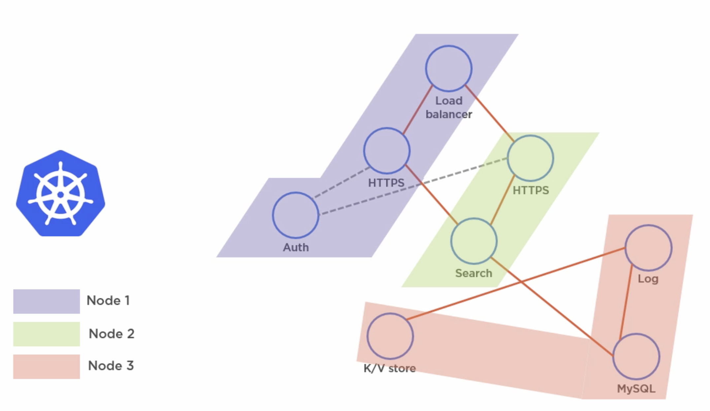

# Part 3: Introduction to Kubernetes

## What is Kubernetes?

Kubernetes is an __orchestrator__ for __microservice__ apps that run on __containers__.

A microservice app in Kubernetes would be made of multiple services (components), each of them packaged as a k8s __pod__.
Kubernetes organises them so that they can work together, this is known as __orchestration__.

 

When we have our component ready, we package it and send it to the K8s __cluster__.
The cluster is made of:

- 1 or more __masters__: these decide which nodes run certain applications. This is known as the __cluster control plane__, the code that takes care of monitoring, making changes, scheduling, responding to events...
- __Nodes__ (a.k.a. minions): they run the applications, report back to the masters and watch for changes.

In order to package our application and give it to the cluster, we will most likely use a __kubernetes deployment__:
1. We containerise the application
2. We define it in an object called a deployment, defining it in a YML file
 

## K8s Masters

