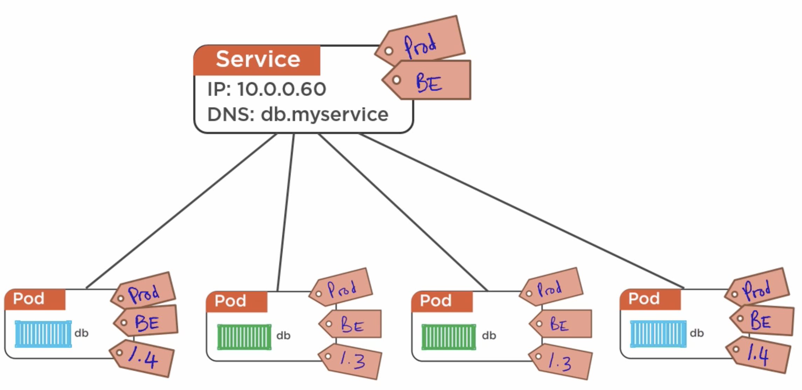
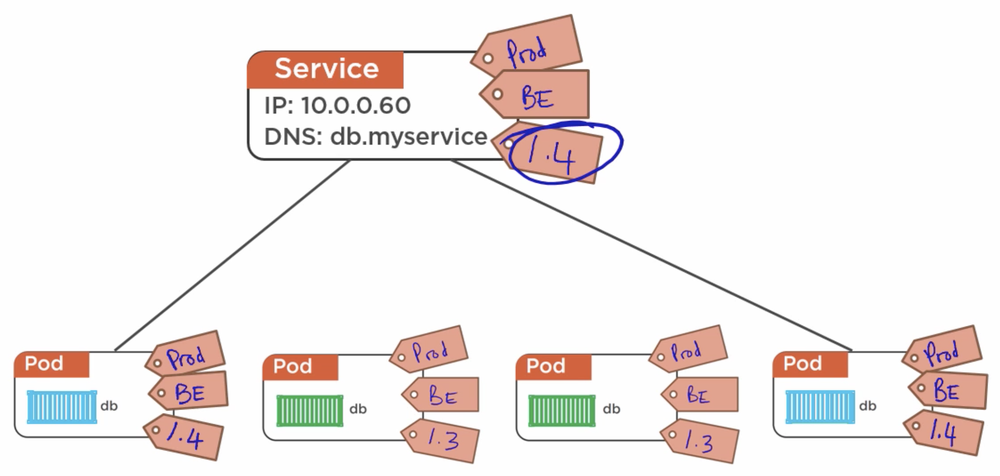

# Part 4: Declaring services and deployments

## The Declarative model

The model in K8s is _declarative_, in the sense that we provide it with a `YAML` or `JSON` __manifest file__, which declares what we want the state to look like. We do not provide any commands to execute, Kubernetes takes care of that.

The manifest files are what constitute and describe the __desired state__ of the application.

If at any point there are errors or changes that make the cluster change, the k8s `control plane` will notice that the current state doesn't match the desired state, then it will perform any actions needed to achieve the desired state again.
 

## Services

Pods are constantly being destroyed and created, and each time this happens their IP address changes. We need an IP address that we can always use to access the services running in the pods, and in order to solve this, we have __Services__.

A service is an object in k8s, such as a Pod or a Deployment, and therefore is defined with a YAML manifest file and created by giving the file to the `apiserver`.

A service:
    - Provides a __stable IP and DNS__ for one or more pods.
    - __Load balances__ the requests it receives, and directs them to the pods.
    - __Updates__ itself with the details of any new pods.
    - Will only send traffic to __healthy pods__.
    - Uses __TCP__ by default, but can use UDP if specified.

A pod belongs to a service by using a label. When the labels of a pod match the labels of a service, the pod is "added" to the service, and requests will be load balanced to it. Any pod that contains the labels of a service will be added to it, even if the pod has more labels.

 

If we add more labels to the service, we can filter our more pods, for example by adding the version we want to use for the service:

 

## Deployments

We use __deployments__ to declare the desired state. They are also a k8s REST object, deployed with a YAML or JSON manifest file given to the `apiserver`. They create __Replication Controllers__ (now replaced by __Replica Sets__) and add features around them.

Some of the features they add are:
    - Simple __rolling updates/rollbacks__.
        * Running __multiple concurrent versions__ of the same app: blue-green deployments, or canary releases.
        * Simple and versioned __rollbacks__.
