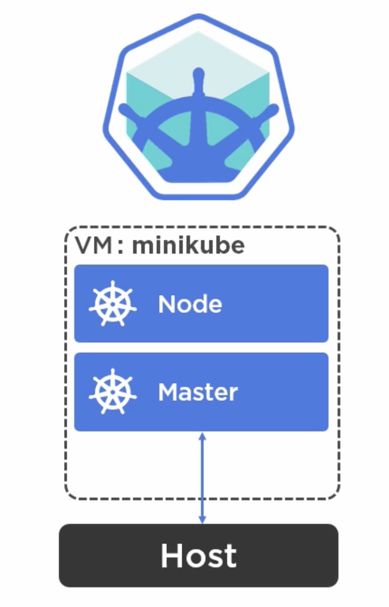

# Part 5: Installing K8s - Minikube

## Minikube

Minikube allows us to try Kubernetes on our own computer, creating a local environment for our cluster.

When we start minikube, it creates and starts a VM on our machine, which spins up a single node K8s cluster. Then, it makes it available to the host machine, so we can control the cluster with `kubectl` as if the cluster was actually running on the machine instead of the VM.



The minikube VM contains `Localkube`, a binary construct that runs Kubernetes. It also contains the `Container runtime`, which is Docker as default.
<br/>

### Installation

1. Install `kubectl`:
```
$ brew install kubectl
```

2. Install `minikube`:
```
$ brew cask install minikube
```

3. Install a virtualisation tool (Virtual Box or Xhyve for example):
```
$ brew cask install virtualbox
```

4. Start minikube. Minikube will default to VirtualBox, so if we are using a different VM we need to specify the VM driver:
```
$ minikube start
OR
$ minikube start --vm-driver=xhyve
😄  minikube v0.34.1 on darwin (amd64)
🔥  Creating virtualbox VM (CPUs=2, Memory=2048MB, Disk=20000MB) ...
💿  Downloading Minikube ISO ...
 184.30 MB / 184.30 MB [============================================] 100.00% 0s
📶  "minikube" IP address is 192.168.99.100
🐳  Configuring Docker as the container runtime ...
✨  Preparing Kubernetes environment ...
💾  Downloading kubeadm v1.13.3
💾  Downloading kubelet v1.13.3
🚜  Pulling images required by Kubernetes v1.13.3 ...
🚀  Launching Kubernetes v1.13.3 using kubeadm ...
🔑  Configuring cluster permissions ...
🤔  Verifying component health .....
💗  kubectl is now configured to use "minikube"
🏄  Done! Thank you for using minikube!
```

It is also possible to determine which k8s version to use with the `--kubernetes-version` flag:
```
$ minikube start --kubernetes-version="v1.6.0"
```

5. Once minikube has started, it will let us know that `kubectl` is now configured to use the cluster. We can confirm this by running:
```
$ kubectl config current-context
minikube

$ kubectl get nodes
NAME       STATUS    ROLES     AGE       VERSION
minikube   Ready     master    31s       v1.13.3
```

6. We can use many interesting commands with minikube, such as `dashboard`, this allows us to see a dashboard with information for our cluster in the browser:
```
$ minikube dashboard
🔌  Enabling dashboard ...
🤔  Verifying dashboard health ...
🚀  Launching proxy ...
🤔  Verifying proxy health ...
🎉  Opening http://127.0.0.1:61964/api/v1/namespaces/kube-system/services/http:kubernetes-dashboard:/proxy/ in your default browser...
```

7. We can stop minikube with the `stop` command, this will stop our cluster, but will leave the same config:
```
$ minikube stop
✋  Stopping "minikube" in virtualbox ...
🛑  "minikube" stopped.

$ kubectl config current-context
minikube
```

8. To actually delete our local cluster, we have to use the `delete` command, again, this will leave the same config:
```
$ minikube delete
🔥  Deleting "minikube" from virtualbox ...
💔  The "minikube" cluster has been deleted.

$ kubectl config current-context
minikube
```
