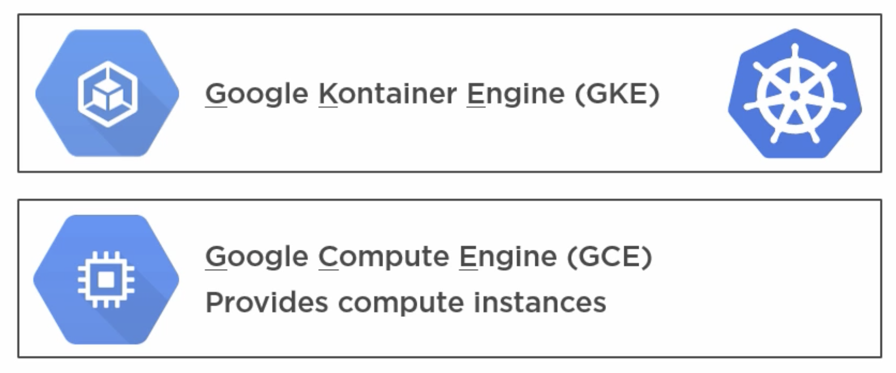

# Part 5B: Installing K8s - Google Container Engine (GKE)

## Google Container Engine

Google Container Engine, or GKE, is layered on top of Google Compute Engine (GCE):
- __GCE__ provides the VMs required to run Kubernetes
- __GKE__ provides the Kubernetes layer

This is known as Kubernetes as a Service.
<br/>


<br/>

### Set up

After creating a GCP account, we can create our cluster in GKE:
- The size specified determines the number of worker nodes we will get, not counting the master

As well as creating it with the form provided in the Google Cloud website, it is also possible to create this with `REST` or `gcloud` command line commands. At the end of the form, we can get access to the commands that would be issued if we sent our form:

- The `REST` option allows you to `POST` a json request to a provided endpoint.
- The `gcloud` option shows the commands to be executed in the terminal to achieve the same cluster.


### Controlling the cluster

We can run `gcloud` commands to get information about our cluster from the terminal:

```
$ gcloud container clusters list
```

The _connect to the cluster_ option provides a `gcloud` command that allows us to configure `kubectl` to connect to our cluster.

It also provides an IP that we can use to check all the endpoints available to get information about our cluster. For example, the `/ui` endpoint gives us access to the dashboard.
