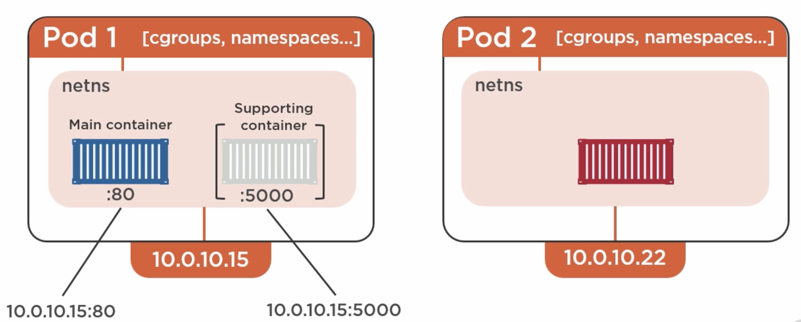

# Part 6: Working with pods

## Pods and Containers

As we already saw, a pod is the _atomic unit_ of schedulling in Kubernetes.

All containers inside a pod will be sharing the same IP address, however they will be running in different ports. This IP defined in the pod is actually a __network namespace__ or `netns`.

This means the pod share a single:
- IP address
- localhost adapter
- Set of ports
- cgroup
- Volumes access
- Network access
- IPC namespaces

 

## Inter-pod communication

